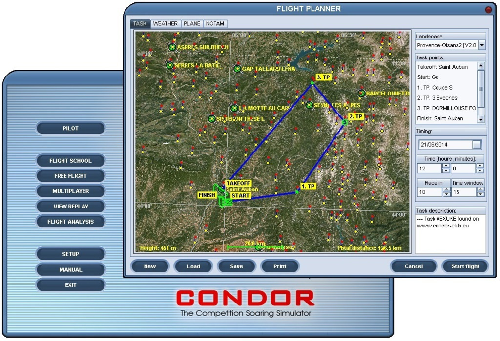
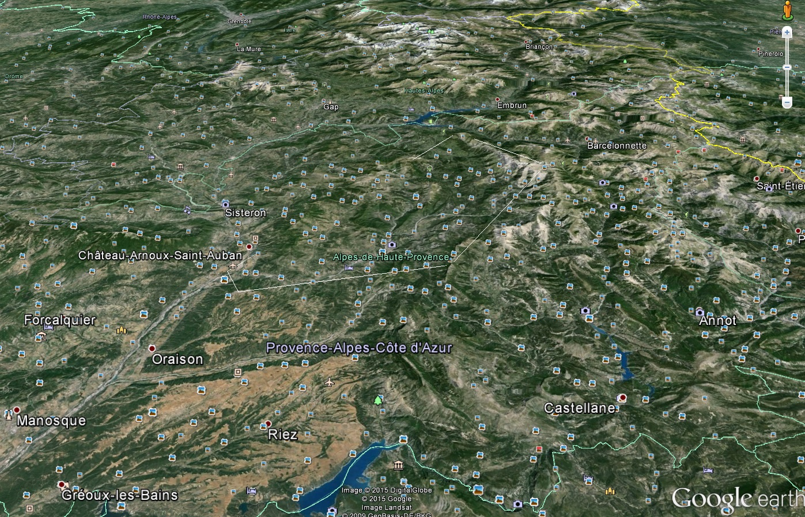
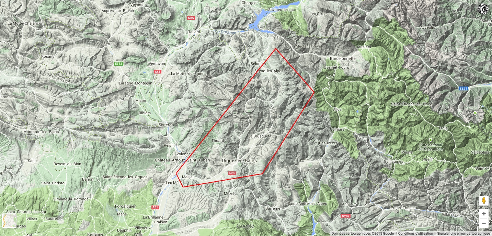
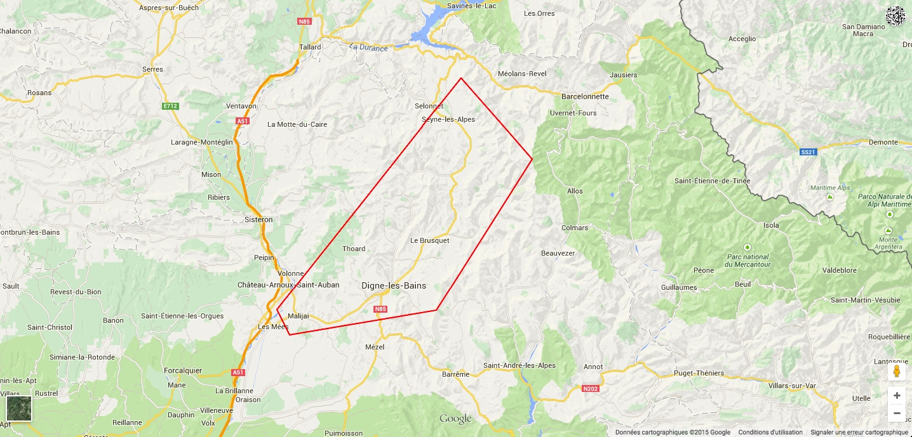
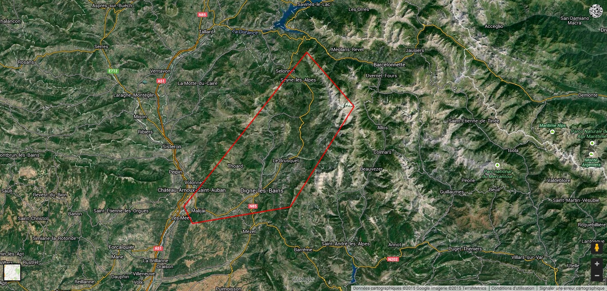

# pycondor
Python script to manage some [Condor Soaring](http://www.condorsoaring.com/) files such as tasks.

## Usage

This work was not carried out by Condor Team
CAUTION: WORK IN PROGRESS - USE AT YOUR OWN RISK

See [ToDo](https://github.com/scls19fr/pycondor/wiki/ToDo) Any help is Welcome!

	C:\...\pycondor>python.exe condor2task.py samples/default.fpl --debug --output xls
	Read 'samples/default.fpl'
	Condor version: 1150
	Using functions from 'C:\Program Files (x86)\Condor\NaviCon.dll'
	With landscape 'Provence-Oisans2'

	MaxX: 207360.000000
	MaxY: 345600.000000
	XYToLat(0.000000,0.000000): 43.223301
	XYToLon(0.000000,0.000000): 7.807540
	XYToLat(207360.000000,0.000000): 43.168266
	XYToLon(207360.000000,0.000000): 5.257740
	XYToLat(207360.000000,345600.000000): 46.272892
	XYToLon(207360.000000,345600.000000): 5.051742
	XYToLat(0.000000,345600.000000): 46.334187
	XYToLon(0.000000,345600.000000): 7.741717

	   Airport Altitude Angle Azimuth Height              Name            PosX  \
	0        1     1500  8105       0   5000       Saint Auban   144740.828125
	1        0     1500    90       0   2500                Go   142760.828125
	2        0     1600   360       0   5000           Coupe S  117142.2265625
	3        0     2700   360       0   5000         3 Eveches   99735.8203125
	4        0     2200   360       0   5000  DORMILLOUSE FORT  111656.5078125
	5        1     1500   180       0   5000       Saint Auban   144740.828125

				 PosY  PosZ Radius  SectorType Width        Lat       Lon
	0   96078.7265625   450   3000           0     0  44.054901  5.984000
	1   91578.7265625   810   3000           0     0  44.015087  6.010722
	2    94980.953125  1543    500           0     0  44.053600  6.328600
	3  120593.0859375  2663   1000           0     0  44.288883  6.536117
	4   134922.265625  2159    500           0     0  44.414448  6.381117
	5   96078.7265625   450   3000           0     0  44.054901  5.984000
	Output 'out\default.xls'

### Spreadsheet (Excel, OpenOffice, LibreOffice) output (xls, xlsx, csv)

### Matplotlib output (png)

### Google Earth output (kml)

[See file](https://raw.githubusercontent.com/scls19fr/pycondor/master/pycondor/out/default.kml)

### Google Maps output

### XCSoar (tsk)

## Help
You can get command line help using:

	C:\...\pycondor> python.exe condor2task.py --help

	Usage: condor2task.py [OPTIONS] FILENAME

	Options:
	  --debug / --no-debug  debug mode
	  --output TEXT         Output type in ['Excel', 'xls', 'xlsx', 'Excelx',
							'CSV', 'matplotlib', 'mpl', 'bmp', 'png', 'jpg',
							'tsk', 'xcsoar']
	  --outdir TEXT         Output directory - default is 'script_directory\out'
	  --condor_path TEXT    Condor Soaring installation path - default is
							C:\Program Files (x86)\Condor
	  --landscape TEXT      Landscape name - should be inside 'Condor\Landscapes'
							directory (it's also the name of a .trn file)
	  --help                Show this message and exit.	
	
##Dependencies
* Windows (because of DLL function calls to `NaviCon.dll`)
* Python 2.7 or Python 3.4

You might install a scientific Python distribution such as [Anaconda Python](http://continuum.io/).
Using such a distribution the following libraries should ever be installed:
* Numpy http://www.numpy.org/
* Pandas http://pandas.pydata.org/
* matplotlib http://matplotlib.org/

You will probably need to install missing libraries such as:
* click (Command Line Interface Creation kit) http://click.pocoo.org/
* xlwt (for Excel .xls output with Python 2.x) http://www.python-excel.org/
* xlwt-future (for Excel .xls output with Python 3.x) https://pypi.python.org/pypi/xlwt-future
* aerofiles http://aerofiles.readthedocs.org/
* pyKML https://pythonhosted.org/pykml/
* jinja2 (template engine)  http://jinja.pocoo.org/

Use

    > conda install name_of_the_package

or

    > pip install name_of_the_package

to install missing libraries.
